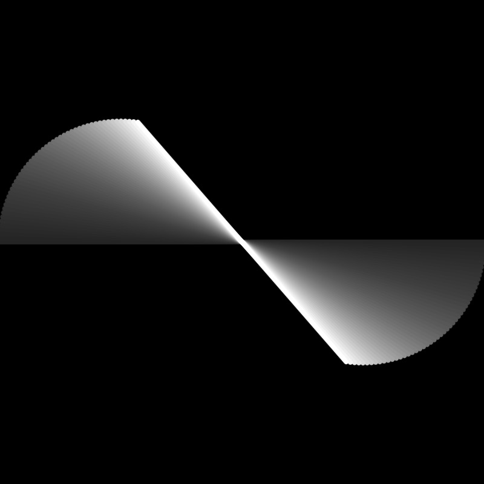
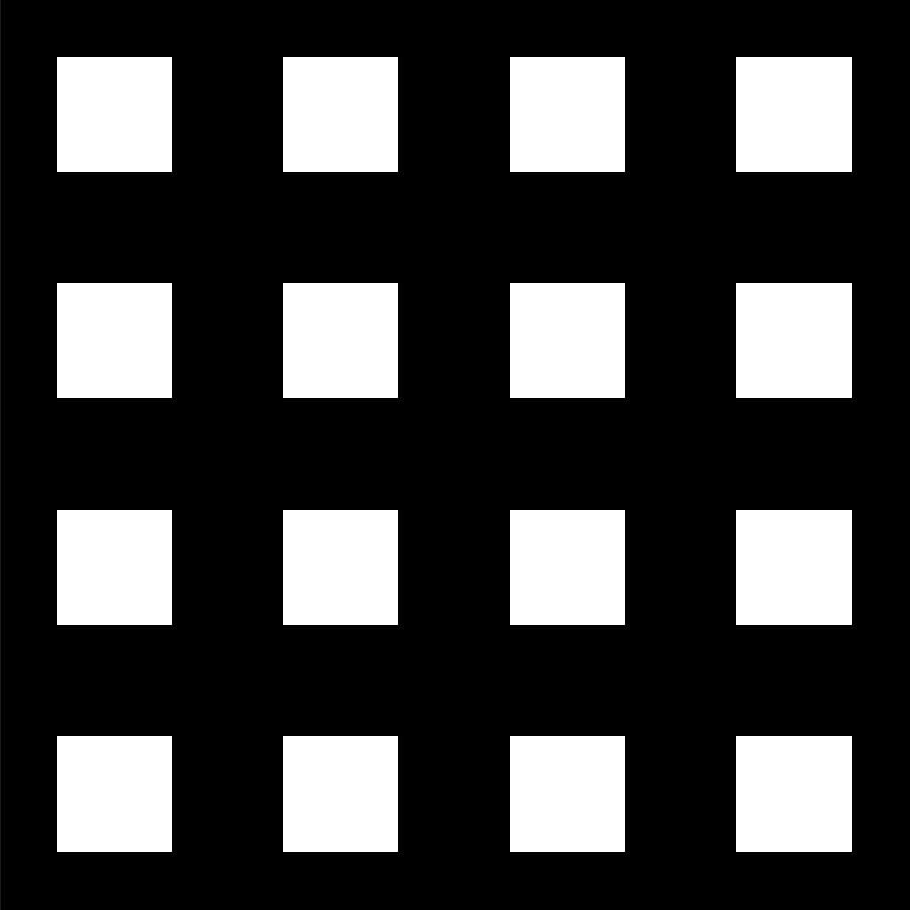

# Genuary 2023

All code from Genuary 2023 Speed Run

## 🔗 Links

- [Live Stream on YouTube](https://www.youtube.com/watch?v=QyGG15J9bAc)
- [Genuary](https://genuary.art)

## 🌄 Gallery

<!-- IMAGE-LIST:START - Do not remove or modify this section -->
<!-- prettier-ignore-start -->
<!-- markdownlint-disable -->
<table>
  <tbody>
    <tr>
      <td align="center"><a href="https://editor.p5js.org/codingtrain/sketches/BhqIXSyQA">  <b>January 1 Perfect GIF Loop</b></a></td>
      <td align="center"><a href="https://editor.p5js.org/codingtrain/sketches/stwbwVLDz">  <b>January 2  Made in Ten Minutes</b></a></td>
     <td align="center"><a href="https://github.com/CodingTrain/Genuary-2023/tree/main/genuary_03">  <b>January 3  Glitch Art</b></a></td>
     <td align="center"><a href="https://github.com/CodingTrain/Genuary-2023/tree/main/genuary_04">  <b>January 4  Intersections</b></a></td>
    </tr>
    <tr>
      <td align="center"><a href="https://github.com/CodingTrain/Genuary-2023/tree/main/genuary_05">  <b>January 5  Debug View</b></a></td>
      <td align="center"><a href="https://editor.p5js.org/codingtrain/sketches/iS6UH1bLf">  <b>January 6  Steal Like an Artist</b></a></td>
     <td align="center"><a href="https://github.com/CodingTrain/Genuary-2023/tree/main/genuary_07">  <b>January 7  Sample a color palette</b></a></td>
     <td align="center"><a href="https://github.com/CodingTrain/Genuary-2023/tree/main/genuary_08">  <b>January 8  SDFs</b></a></td>
    </tr>
    <tr>
      <td align="center"><a href="https://github.com/CodingTrain/Genuary-2023/tree/main/genuary_09">  <b>January 9  Plants</b></a></td>
      <td align="center"><a href="https://editor.p5js.org/codingtrain/sketches/w8yM-TPJ1">  <b>January 10  Generative Music</b></a></td>
     <td align="center"><a href="https://editor.p5js.org/codingtrain/sketches/86-bIBI5m">  <b>January 11  Suprematism</b></a></td>
     <td align="center"><a href="https://github.com/CodingTrain/Genuary-2023/tree/main/genuary_12">  <b>January 12  Tessellation</b></a></td>
    </tr>
     <tr>
      <td align="center"><a href="https://github.com/CodingTrain/Genuary-2023/tree/main/genuary_13">  <b>January 13 Somehing you’ve always wanted to learn</b></a></td>
      <td align="center"><a href="https://editor.p5js.org/codingtrain/sketches/KiKwa2Hjl">  <b>January 14  Aesemic</b></a></td>
     <td align="center"><a href="https://editor.p5js.org/codingtrain/sketches/86-bIBI5m">  <b>January 15  Sine waves</b></a></td>
     <td align="center"><a href="https://editor.p5js.org/codingtrain/sketches/1C1itEl_t">  <b>January 16  A reflection of a reflection</b></a></td>
    </tr>
     <tr>
      <td align="center"><a href="https://github.com/CodingTrain/Genuary-2023/tree/main/genuary_17">  <b>January 17 A grid in a grid in a grid</b></a></td>
      <td align="center"><a href="https://github.com/CodingTrain/Genuary-2023/tree/main/genuary_18">  <b>January 18  Definitely not a grid</b></a></td>
     <td align="center"><a href="https://github.com/CodingTrain/Genuary-2023/tree/main/genuary_19">  <b>January 19  Black and white</b></a></td>
     <td align="center"><a href="https://editor.p5js.org/codingtrain/sketches/VqsxfNW_P">  <b>January 20  Art Deco</b></a></td>
    </tr>
     <tr>
      <td align="center"><a href="https://editor.p5js.org/codingtrain/sketches/8VbPMDnOd">  <b>January 21  Persian Rug</b></a></td>
      <td align="center"><a href="https://editor.p5js.org/codingtrain/sketches/ch0QeTpCl">  <b>January 22  Shadows</b></a></td>
     <td align="center"><a href="https://editor.p5js.org/codingtrain/sketches/tSnJ9QcP4">  <b>January 23  More Moiré</b></a></td>
     <td align="center"><a href="https://github.com/CodingTrain/Genuary-2023/tree/main/genuary_24">  <b>January 24 Textile</b></a></td>
    </tr>
      <tr>
      <td align="center"><a href="https://editor.p5js.org/codingtrain/sketches/m7Pd2QfSQ">  <b>January 25  Yayoi Kusama</b></a></td>
      <td align="center"><a href="https://editor.p5js.org/codingtrain/sketches/6Wwzkc7EV">  <b>January 26 My kid could have made it</b></a></td>
     <td align="center"><a href="https://editor.p5js.org/codingtrain/sketches/AW2otUixx">  <b>January 27  Style of Hilma Af Klint</b></a></td>
     <td align="center"><a href="https://editor.p5js.org/codingtrain/sketches/DPBwPzr7J">  <b>January 28  Generative poetry</b></a></td>
    </tr>
     <tr>
      <td align="center"><a href="https://github.com/CodingTrain/Genuary-2023/tree/main/genuary_29">  <b>January 29  Maximalism</b></a></td>
      <td align="center"><a href="https://github.com/CodingTrain/Genuary-2023/tree/main/genuary_30">  <b>January 30  Minimalism</b></a></td>
     <td align="center"><a href="https://github.com/CodingTrain/Genuary-2023/tree/main/genuary_31">  <b>January 31  Break a previous image</b></a></td>
    </tr>
     </tbody>
</table>

<!-- markdownlint-restore -->
<!-- prettier-ignore-end -->

<!-- IMAGE-LIST:END -->

## Animations

