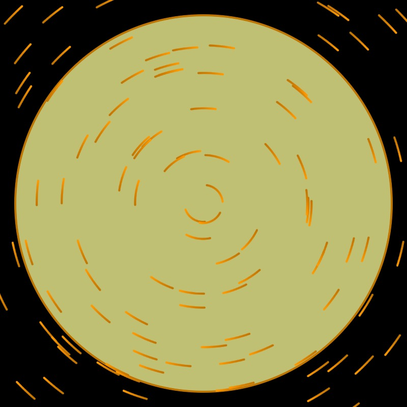
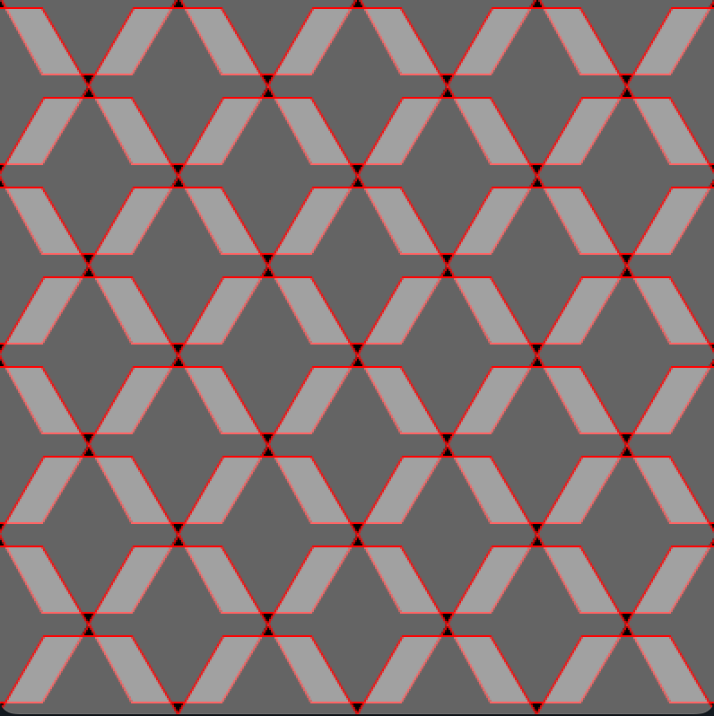
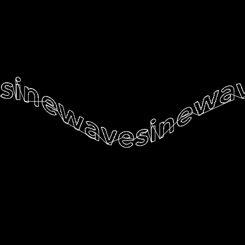
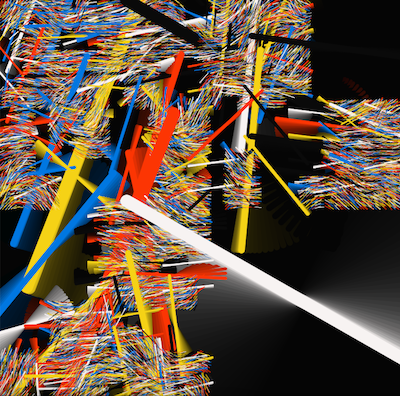

# Genuary-2023

All code from Genuary 2023 Speed Run

## Links

- [Live Stream on YouTube](https://www.youtube.com/watch?v=QyGG15J9bAc)
- [Genuary](https://genuary.art)

## Code

### January 1: Perfect loop / Infinite loop / endless GIFs

[Perfect loop / Infinite loop / endless GIFs](https://editor.p5js.org/codingtrain/sketches/BhqIXSyQA)

### January 2: Made in 10 minutes

[Made in 10 minutes](https://editor.p5js.org/codingtrain/sketches/stwbwVLDz)

### January 3: Glitch Art

[Glitch Art](./genuary_03/)

### January 4: Intersections

[Intersections](./genuary_04/)

### January 5: Debug View

[Debug view](./genuary_05/)

### January 6: Steal Like an Artist

[Steal Like An Artist](https://editor.p5js.org/codingtrain/sketches/iS6UH1bLf)

### January 7: Sample a color palette from your favorite movie/album cover

[Sample a color palette from your favorite movie/album cover](./genuary_07/)

### January 8: Signed Distance Functions

[Signed Distance Functions](./genuary_08/)

### January 9: Plants

[Plants](./genuary_09/)

### January 10: Generative Music

[Generative music](https://editor.p5js.org/codingtrain/sketches/w8yM-TPJ1)

### January 11: Suprematism

[Suprematism](https://editor.p5js.org/codingtrain/sketches/86-bIBI5m)

### January 12: Tessellation

[Tessellation](./genuary_12/)

### January 13: Something you’ve always wanted to learn

[Something you’ve always wanted to learn]()

### January 14: Aesemic

[Aesemic](https://editor.p5js.org/codingtrain/sketches/KiKwa2Hjl)

### January 15: Sine waves

[Sine waves](https://editor.p5js.org/codingtrain/sketches/LaYMQFPld)

### January 16: Reflection of a reflection

[Reflection of a reflection](https://editor.p5js.org/codingtrain/sketches/1C1itEl_t)

### January 17: A grid inside a grid inside a grid

[A grid inside a grid inside a grid](./genuary_17/)

### January 18: Definitely not a grid

[Definitely not a grid](./genuary_18/)

### January 19: Black and white

[Black and white](./genuary_19/)

### January 20: Art Deco

[Art Deco](https://editor.p5js.org/codingtrain/sketches/VqsxfNW_P)

### January 21: Persian Rug

[Persian Rug](https://editor.p5js.org/codingtrain/sketches/8VbPMDnOd)

### January 22: Shadows

[Shadows](https://editor.p5js.org/codingtrain/sketches/ch0QeTpCl)

### January 23: More Moiré

[More Moiré](https://editor.p5js.org/codingtrain/sketches/tSnJ9QcP4)

### January 24: Textile

[Textile](./genuary_24/)

### January 25: Yayoi Kusama

[Yayoi Kusama](https://editor.p5js.org/codingtrain/sketches/m7Pd2QfSQ)

### January 26: My kid could have made that

[My kid could have made that](https://editor.p5js.org/codingtrain/sketches/6Wwzkc7EV)

### January 27: In the style of Hilma Af Klint

[In the style of Hilma Af Klint](https://editor.p5js.org/codingtrain/sketches/AW2otUixx)

### January 28: Generative poetry

[Generative poetry](https://editor.p5js.org/codingtrain/sketches/DPBwPzr7J)

### January 29: Maximalism

[Maximalism](./genuary_29/)

### January 30: Minimalism

[Minimalism](./genuary_30/)

### January 31: Deliberately break one of your previous images, take one of your previous works and ruin it. Alternatively, remix one of your previous works.

[Deliberately break one of your previous images](./genuary_31/)
